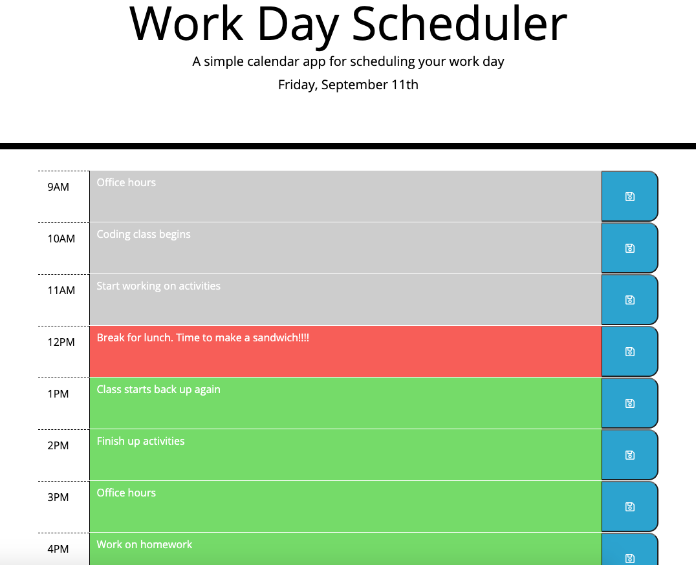

# Work-Day-Scheduler332

## Description

In this project, I have created a daily work day scheduler that allows the user to save their events for each hour of the work day.  This app will run in the browser and features dynamically updated HTML and CSS powered by jQuery and Moment.js.

## Table of Contents

- [Installation](#installation)
- [Usage](#usage)
- [Credits](#credits)
- [License](#license)

## Installation

Click this link in order to use the work day scheduler:
https://cgriffin332.github.io/Work-Day-Scheduler332/

## Usage

When the webpage loads, the user is presented with a work day scheduler, complete with the current date and time slots for each hour of the work day. The time slots are color coded to indicate if the hour slot is in the past(grey), present(red), or future(green).

The user can input their schedule into each text area and save their information by clicking on the corresponding save button.

This information is saved onto local storage, so the info will remain even if the page is refreshed.

If the user wants to remove something from the schedule, simply delete the text and press save again.

## Credits

This project was asigned to me by my Georgia Tech Bootcamp. I used jQuery and Moment.js to help power the site.

## License

MIT License

Copyright (c) [2020] [Calvin Griffin]

Permission is hereby granted, free of charge, to any person obtaining a copy
of this software and associated documentation files (the "Software"), to deal
in the Software without restriction, including without limitation the rights
to use, copy, modify, merge, publish, distribute, sublicense, and/or sell
copies of the Software, and to permit persons to whom the Software is
furnished to do so, subject to the following conditions:

The above copyright notice and this permission notice shall be included in all
copies or substantial portions of the Software.

THE SOFTWARE IS PROVIDED "AS IS", WITHOUT WARRANTY OF ANY KIND, EXPRESS OR
IMPLIED, INCLUDING BUT NOT LIMITED TO THE WARRANTIES OF MERCHANTABILITY,
FITNESS FOR A PARTICULAR PURPOSE AND NONINFRINGEMENT. IN NO EVENT SHALL THE
AUTHORS OR COPYRIGHT HOLDERS BE LIABLE FOR ANY CLAIM, DAMAGES OR OTHER
LIABILITY, WHETHER IN AN ACTION OF CONTRACT, TORT OR OTHERWISE, ARISING FROM,
OUT OF OR IN CONNECTION WITH THE SOFTWARE OR THE USE OR OTHER DEALINGS IN THE
SOFTWARE.

---